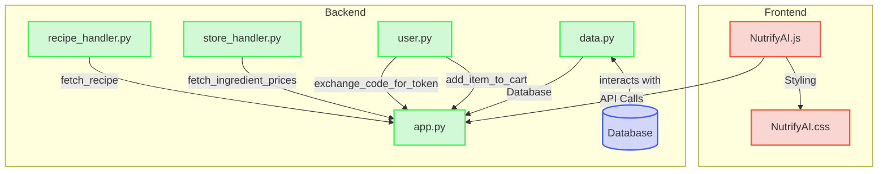

# System Structure

The system is composed of a front end and back end. The front end consists of NutrifyAI.js and NutrifyAI.css. These provide the visual layout of the program and the UI the user uses to interact with the backend functions. The backend consists of a python file app.y which uses classes from files recipe_handler.py, store_handler.py, user.py, and data.py. The front end javascript uses API calls to call functions from the backend such as save-data which puts the current recipe into the database.

### Nutrify.js
- /get-past: calls the python database class to returns all recipes stored in the database in json form
- /generate-recipe: calls the python recipe_handler to generate a recipe
- /modify-recipe: calls the python recipe_handler to make changes to the current recipe if the user requests
- /fetch-prices: calls store_handler to get prices (not included in final product)
- /add-to-cart: calls cart_handler to add the current list of ingredients to the Kroger cart
- /save-recipe: calls the python database class to save the current recipe in json form to the database
