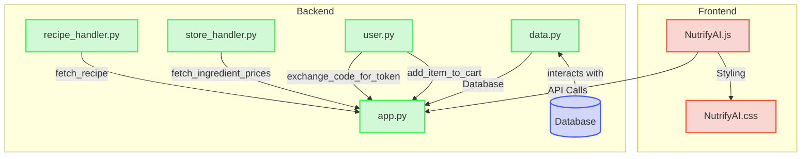

# System Structure

### File Structure Diagram


### User Process Flow
```mermaid
flowchart TD
    A([Start]) -->|Enter dish| D{Recipe screen}
    A -->|Recipe History| C(Choose past recipe)
    C --> D
    D -->|Login| E(Kroger Login)
    E --> D
    D --> F(Uncheck ingredients)
    F --> D
    E --> G(Add to cart)
    G --> D
    D --> H(Save recipe)
````

The system is composed of a front end and back end. The front end consists of NutrifyAI.js and NutrifyAI.css. These provide the visual layout of the program and the UI the user uses to interact with the backend functions. The backend consists of a python file app.y which uses classes from files recipe_handler.py, store_handler.py, user.py, and data.py. The front end javascript uses API calls to call functions from the backend such as save-data which puts the current recipe into the database.

This design was chosen in order to create a modular system that allows for cooperative development.

### Front-end functions/backend calls
- /get-past: calls the python database class to returns all recipes stored in the database in json form
- /generate-recipe: calls the python recipe_handler to generate a recipe
- /modify-recipe: calls the python recipe_handler to make changes to the current recipe if the user requests
- /fetch-prices: calls store_handler to get prices
- /add-to-cart: calls cart_handler to add the current list of ingredients to the Kroger cart
- /save-recipe: calls the python database class to save the current recipe in json form to the database

### Backend calls
callback()
Kroger redirects here with ?code=XXXX after user logs in. We exchange that code for a user-level token, then store it in session.

login()
Redirects the user to Kroger's OAuth2 authorization endpoint requesting the cart.

add-to-cart()
Use the Kroger API to search for products matching the ingredients list and adds them to the cart.

fetch-prices()
Calls the fetch_ingredient_prices class in store_handler to call the Kroger API to get prices.

get_past_recipes()
Calls the Database class in data.py to get all database items to show history in the UI.

save_recipe()
Calls the Database class in data.py to save a database entry of the json of the current recipe the user has generated.

generate_recipe()
Calls the fetch_recipe class in recipe_handler to call the OpenAI API to generate a recipe.
